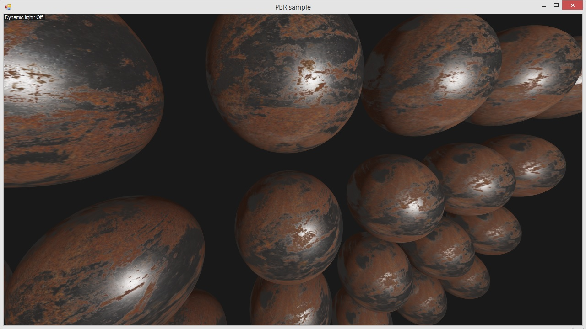

# OpenGLSamples
Some of the LearnOpenGL samples in C# (https://github.com/JoeyDeVries/LearnOpenGL)

Textures (https://github.com/JoeyDeVries/LearnOpenGL/tree/master/resources/textures)

PBR (Physically based rendering) sample:

